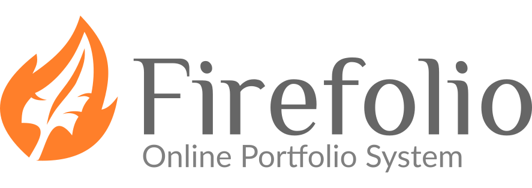

# Firefolio
An Online Portfolio System for Professional Programmers



## About
**Firefolio** is a self-hosted web application designed to help programmers
showcase their work to employers. It's like a content managament system, but
focused eniterly on creating a single kind of website.

## Requirements
- PHP v`7.0.0` or greater
- A web server to host the files on
- A relational database such as MySQL or MariaDB connected to the server

[XAMPP](https://www.apachefriends.org/) is the recommended software for
developing **Firefolio**. It's a web server that runs locally on your computer
and meets all of the above requirements.

## History
**Firefolio** was originally a prototype called [Blue Carbon](https://github.com/blue-carbon)
which was made as part of a university assignment in web design. After being
dissatisfied with it's performance and myriad of design quirks,
I decided to rebuild the entire thing from scratch in order for it to be more
accessible to a wider audience outside of myself.

## License
Firefolio is released under the terms of the
[MIT Open Source License](http://www.opensource.org/licenses/MIT). Feel free to
use it however you like.

```
MIT License

Copyright (c) 2018 Callum John

Permission is hereby granted, free of charge, to any person obtaining a copy
of this software and associated documentation files (the "Software"), to deal
in the Software without restriction, including without limitation the rights
to use, copy, modify, merge, publish, distribute, sublicense, and/or sell
copies of the Software, and to permit persons to whom the Software is
furnished to do so, subject to the following conditions:

The above copyright notice and this permission notice shall be included in all
copies or substantial portions of the Software.

THE SOFTWARE IS PROVIDED "AS IS", WITHOUT WARRANTY OF ANY KIND, EXPRESS OR
IMPLIED, INCLUDING BUT NOT LIMITED TO THE WARRANTIES OF MERCHANTABILITY,
FITNESS FOR A PARTICULAR PURPOSE AND NONINFRINGEMENT. IN NO EVENT SHALL THE
AUTHORS OR COPYRIGHT HOLDERS BE LIABLE FOR ANY CLAIM, DAMAGES OR OTHER
LIABILITY, WHETHER IN AN ACTION OF CONTRACT, TORT OR OTHERWISE, ARISING FROM,
OUT OF OR IN CONNECTION WITH THE SOFTWARE OR THE USE OR OTHER DEALINGS IN THE
SOFTWARE.
```
