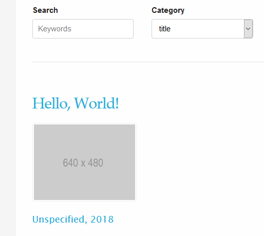
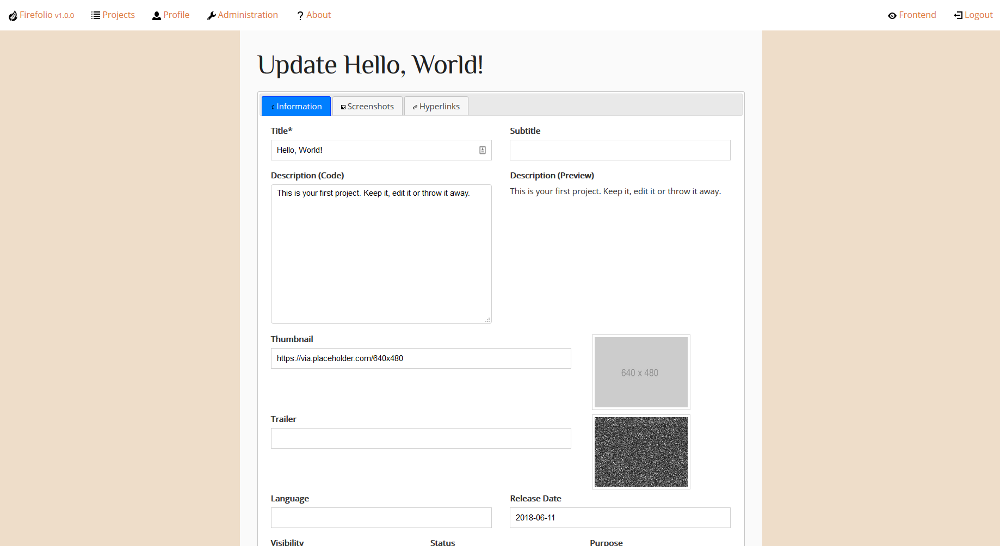
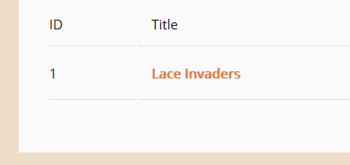

Your First Project
==================

When you first install Firefolio onto your web server, you'll be given a single
project that's been put on your portfolio by default. It looks a little something
like this:

which isn't something you'd want an employer to see, but it makes a good example.
You can click on its thumbnail to be given more information about it, like its
name, when it was released, and what it looks like.

In this step of the tutorial, I'm going to teach you how to edit this first
project to turn it into something a little more presentable.

--------------------------------------------------------------------------------

Authentication
^^^^^^^^^^^^^^

First, you'll want to login to Firefolio. You can do that by clicking on the
link at the bottom of the page. Type in your username and password and submit
the form. If your credentials are correct, you'll be sent to the backend:

.. image:: firefox_2018-06-21_14-09-01.png

What you're looking at is the main project view. This shows you a list of all the projects
currently in your portfolio; their ID, their title and whether someone who's not
logged in can see them. There are also a number of buttons here for creating new
projects and the like, but we're not going to worry about them for now.

Right now, all we want to do is to edit the placeholder project. The easiest way
to do that is to click on its title. Once you'll do that, you'll be brought to
this menu:

Lace Invaders (Preparation)
^^^^^^^^^^^^^^^^^^^^^^^^^^^

Before you start fill in all of the various forms on this page, it's best to think of
a software project you've worked on that you'd like to replace it with. This can
be anything, but for the sake of this tutorial, let's say that you worked on a game
called "Lace Invaders", about tying the shoes of invading aliens, and you'd
like to show it off. How do you do that?

In order to get your employer to care about "Lace Invaders" you'll first need to gather
some information on it. Normally, this would involve racking your brain to remember
who else worked on it, what programming language it used, and digging up the executable
in order to take some screenshots and videos from it being played and so-on.

The good thing about "Lace Invaders" however, is that it doesn't exist.
This means I get to make up all of the information for you:

+-------------------+-------------------------------------------+
| Title             | Lace Invaders                             |
+-------------------+-------------------------------------------+
| Subtitle          | Arcade shoelace shooter                   |
+-------------------+-------------------------------------------+
| Thumbnail         | https://via.example.com/640x480           |
+-------------------+-------------------------------------------+
| Trailer           | https://youtu.be/dQw4w9WgXcQ              |
+-------------------+-------------------------------------------+
| Screenshot        | https://i.imgur.com/JgosWT8.png           |
+-------------------+-------------------------------------------+
| Language          | C++                                       |
+-------------------+-------------------------------------------+
| Status            | Released                                  |
+-------------------+-------------------------------------------+
| Purpose           | Individual Project (Game)                 |
+-------------------+-------------------------------------------+
| Release Date      | 2018-06-13                                |
+-------------------+-------------------------------------------+
| Official Website  | http://itsseajay.github.io/lace-invaders  |
+-------------------+-------------------------------------------+

Updating Projects
^^^^^^^^^^^^^^^^^

Now that we've got all of the required information, we can now use it to fill in
the main form. Note that trailer, thumbnail and screenshot(s) for "Lace Invaders"
are given as external hyperlinks. As of release version ``1.0.0`` there isn't any
kind of upload functionality within Firefolio itself. In order to add images
and videos, you'll need to upload them to the server directly through FTP, or
have them hosted through an external service elsewhere on the internet.

Proceed to fill in each field with the appropriate information above.
As you do so, it might be a good idea for you to ocassionally click
the "save" button near the bottom left of the page, which updates its information
asynchronously without you having to navigate away. There's also a keyboard
shortcut for this; on a Windows computer, you can push the ``Ctrl + S`` keys to
save, or ``Cmd + S`` on a Mac.

When you've finished, click the "finish" button. After a short wait, you'll be
taken back to the projects menu. If you've followed the steps correctly, the
title of the example projects should have changed:

Make sure to navigate to the frontend and check out your renewed project!
