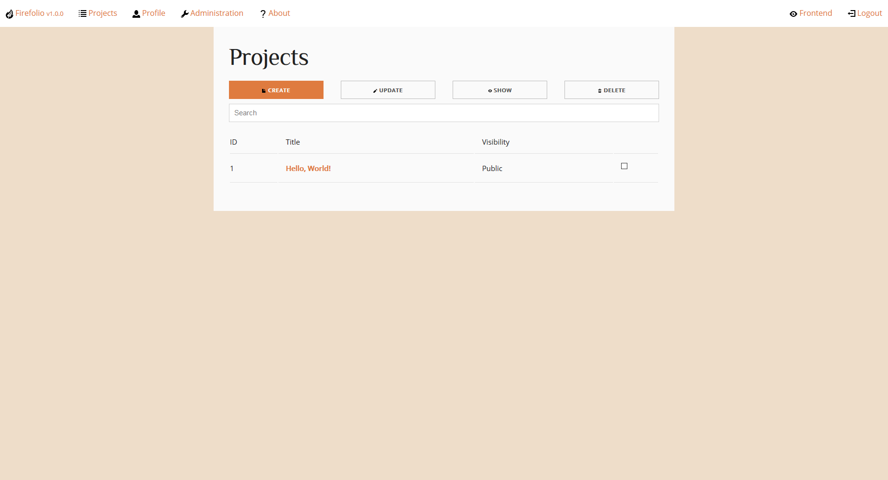

Your First Project
==================

When you first install Firefolio onto your web server, you'll be given a single
project that's been put on your portfolio by default. It looks a little something
like this:

.. image:: firefox_2018-06-21_13-57-54.png

which isn't something you'd want an employer to see, but it makes a good example.
You can click on its thumbnail to be given more information about it, like its
name, when it was released, and what it looks like.

In this step of the tutorial, I'm going to teach you how to edit this first
project to turn it into something a little more presentable.

--------------------------------------------------------------------------------

Authentication
^^^^^^^^^^^^^^

First, you'll want to login to Firefolio. You can do that by clicking on the
link at the bottom of the page. Type in your username and password and submit
the form. If your credentials are correct, you'll be sent to the backend:

What you're looking at is the main project view. This shows you a list of all the projects
currently in your portfolio; their ID, their title and whether someone who's not
logged in can see them. There are also a number of buttons here for creating new
projects and the like, but we're not going to worry about them for now.

Right now, all we want to do is to edit the placeholder project. The easiest way
to do that is to click on its title. Once you'll do that, you'll be brought to
this menu:

Lace Invaders (Preparation)
^^^^^^^^^^^^^^^^^^^^^^^^^^^

Before you start fill in all of the various forms on this page, it's best to think of
a software project you've worked on that you'd like to replace it with. This can
be anything, but for the sake of this tutorial, let's say that you worked on a game
called "Lace Invaders", about tying the shoes of invading aliens, and you'd
like to show it off. How do you do that?

In order to get your employer to care about "Lace Invaders" you'll need to gather
information on it.
